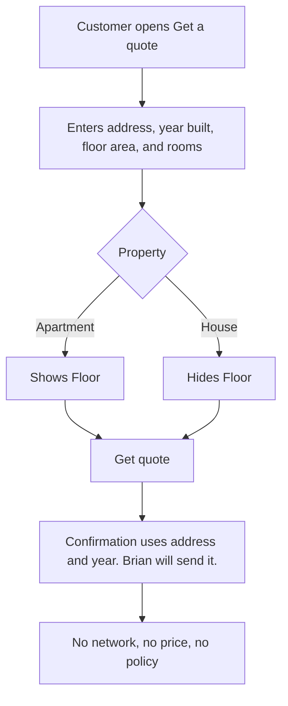

# Quote page

The first product surface is a **home insurance quote page**. The customer is buying an apartment or house. They enter a few facts about the home. Brian uses the form to send them a price. Get quote does not hit a real API yet.

## What the customer sees

- Home cover, quote id QT-1842, badge Buyer form
- Title: Get a quote
- Address
- Property: Apartment or House
- Year built
- Floor area (m²)
- Floor, only when the type is Apartment
- Rooms
- Get quote

House hides Floor. Apartment shows Floor.

After Get quote, a confirmation line uses the typed address and year and says Brian will send it. No price, no policy.

## Flow

The playground in `cursor-exploration` already has Rooms.

## What is real vs fake

- **Real:** the form layout and the kit primitives it is built from (`Button`, `TextField`, `SegmentedControl`, `Badge` in `gator-elements`).
- **Fake:** submitting Get quote. No network, no price, no policy.

## Where it lives in code

- Kit primitives: `gator-elements`
- Product form: `gator-frontend`
- Throwaway playground for Brian/Bojan: `cursor-exploration`

This brief is the product intent. The code repos are the implementation.
